# SportsPro Technical Support

## 📌 1. Overview

**SportsPro Technical Support** is a full-stack web application developed for **CSC3480 Web Technology Assignments**.

It allows SportsPro staff to manage **products, technicians, customers, and product registrations** through a responsive web interface. The project follows a **client-server architecture** using **Node.js**, **Express**, **PostgreSQL**, and **Docker**. **Nginx** is used as a reverse proxy and load balancer to distribute requests across multiple application instances.

The application demonstrates:

- RESTful API design
- Server-side rendering with Pug
- Responsive frontend UI
- Relational database modelling with Sequelize
- Containerised deployment with Docker Compose
- Reverse proxy and load balancing with Nginx

---

## ✨ 2. Features

### 2.1 Product Management

- View all products
- Add new products
- Edit product details
- Delete products

### 2.2 Technician Management

- View all technicians
- Add technicians
- Edit technician details
- Delete technicians

### 2.3 Customer Management

- Search customers by last name
- View customer details
- Edit customer information

### 2.4 Product Registration

- Customer login using email
- Register products for a customer
- Prevent duplicate registrations
- View customer registrations

### 2.5 Additional Functionality

- Responsive user interface
- RESTful API
- PostgreSQL database integration
- Docker containerisation
- Nginx reverse proxy
- Load balancing across multiple application instances
- Server-side rendered pages with reusable Pug templates

---

## 🧰 3. Technology Stack

### 3.1 Frontend

- HTML5
- Pug
- CSS3
- Vanilla JavaScript (ES Modules)

### 3.2 Backend

- Node.js
- Express.js
- Sequelize ORM

### 3.3 Database

- PostgreSQL

### 3.4 Infrastructure

- Docker
- Docker Compose
- Nginx

---

## 🏗️ 4. Project Structure

The project is organised into separate frontend, backend, infrastructure, and documentation components.

```text
sportspro/
│
├── client/
│   ├── public/             # Static assets such as CSS, JS, images, and libraries
│   └── views/              # Pug templates
│       ├── layouts/        # Base layout templates
│       ├── mixins/         # Reusable Pug mixins
│       ├── pages/          # Individual page templates
│       └── partials/       # Shared page fragments
│
├── server/
│   ├── src/
│   │   ├── config/         # Database and application configuration
│   │   ├── controllers/    # HTTP request handlers
│   │   ├── middlewares/    # Express middleware
│   │   ├── models/         # Sequelize models and associations
│   │   ├── routes/         # Application and API routes
│   │   ├── services/       # Business logic
│   │   └── utils/          # Shared utility functions
│   │
│   └── database/
│       ├── 01-schema.sql   # Database schema
│       ├── 02-seed.sql     # Sample data
│       └── data/           # CSV files used for seeding
│
├── nginx/
│   ├── Dockerfile
│   └── nginx.conf          # Reverse proxy and load balancing config
│
├── screenshots/            # Screenshots included in this README
│
├── Dockerfile              # Express application image
├── compose.yaml            # Multi-container Docker configuration
├── package.json
└── README.md
```

The application follows a layered architecture where controllers handle HTTP requests, services contain business logic, models manage database access, and routes define the available endpoints. This separation improves maintainability and scalability.

---

## 🌐 5. Request Flow

### 5.1 Page Requests

1. The browser requests a page.
2. Express routes the request to the correct page controller.
3. The controller prepares the data.
4. Pug renders the HTML response.
5. The browser receives the rendered page.

### 5.2 API Requests

1. Frontend JavaScript sends a request to the API.
2. Express routes the request to an API controller.
3. The controller validates input and calls a service.
4. The service communicates with Sequelize and PostgreSQL.
5. A JSON response is returned to the frontend.

---

## 🐳 6. Docker Architecture

```text
                     Browser
                         │
                http://localhost:8080
                         │
                         ▼
                 +----------------+
                 |     Nginx      |
                 | Reverse Proxy  |
                 +----------------+
                    │          │
                    ▼          ▼
               +---------+ +---------+
               |  App 1  | |  App 2  |
               +---------+ +---------+
                     \        /
                      \      /
                       ▼    ▼
                 +---------------+
                 | PostgreSQL DB |
                 +---------------+
```

Nginx acts as both a reverse proxy and a load balancer, distributing incoming requests across two Express application instances using the default round-robin strategy.

| Service  | Purpose                         |
| -------- | ------------------------------- |
| database | PostgreSQL database             |
| app1     | Express application instance    |
| app2     | Express application instance    |
| nginx    | Reverse proxy and load balancer |

---

## ✅ 7. Prerequisites

The following software must be installed:

- Docker Desktop

No additional software, database setup, or environment configuration is required.

---

## 🚀 8. Running the Application

Clone the repository and navigate to the project directory.

Start the application using Docker Compose, you can run the following command in your terminal at the root directory of the project:

```bash
docker compose up
```

To run the application in detached mode:

```bash
docker compose up -d
```

During the first startup, Docker will automatically:

- build the application image
- create the PostgreSQL database
- create the database schema
- import the sample data
- start two Express application instances
- start the Nginx reverse proxy

Once all containers are running, open the application in your browser at:

```text
http://localhost:8080
```

The PostgreSQL container automatically initialises the database during the first statrup.
The following scripts are executed in order:

1. `01-schema.sql`
   - Creates the database schema
   - Creates all required tables
   - Defines constraints and relationships

2. `02-seed.sql`
   - Imports the supplied sample data
   - Populates the database using CSV files

No manual database configuration is required.

To stop the application:

```bash
docker compose down
```

To completely reset the database and remove all containers, networks, and volumes:

```bash
docker compose down -v
```

---

## 📖 9. API Documentation

### 9.1 Products

| Method | Endpoint                   | Description           |
| ------ | -------------------------- | --------------------- |
| GET    | /api/products              | Retrieve all products |
| GET    | /api/products/:productCode | Retrieve a product    |
| POST   | /api/products              | Create a new product  |
| PUT    | /api/products/:productCode | Update a product      |
| DELETE | /api/products/:productCode | Delete a product      |

### 9.2 Technicians

| Method | Endpoint                 | Description              |
| ------ | ------------------------ | ------------------------ |
| GET    | /api/technicians         | Retrieve all technicians |
| GET    | /api/technicians/:techId | Retrieve a technician    |
| POST   | /api/technicians         | Create a technician      |
| PUT    | /api/technicians/:techId | Update a technician      |
| DELETE | /api/technicians/:techId | Delete a technician      |

### 9.3 Customers

| Method | Endpoint                                 | Description                   |
| ------ | ---------------------------------------- | ----------------------------- |
| GET    | /api/customers                           | Retrieve all customers        |
| GET    | /api/customers/search?lastName=:lastName | Search customers by last name |
| GET    | /api/customers/:customerId               | Retrieve customer details     |
| PUT    | /api/customers/:customerId               | Update customer information   |
| POST   | /api/customers/login                     | Customer login                |

### 9.4 Registrations

| Method | Endpoint                       | Description                           |
| ------ | ------------------------------ | ------------------------------------- |
| POST   | /api/registrations             | Register a product for a customer     |
| GET    | /api/registrations/:customerId | Retrieve registrations for a customer |

---

## 🕒 10. Error Handling

The application implements centralised error handling using Express middleware.

Common HTTP status codes include:

- 200 OK
- 201 Created
- 400 Bad Request
- 401 Unauthorized
- 404 Not Found
- 409 Conflict
- 500 Internal Server Error

---

## 🖼️ 11. Screenshots

### 11.1 Home Page

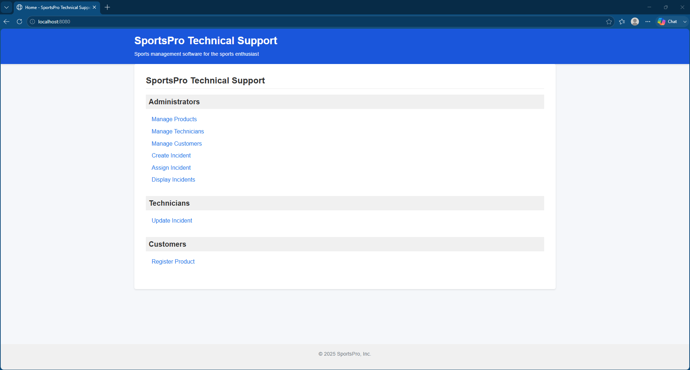

### 11.2 Product Management

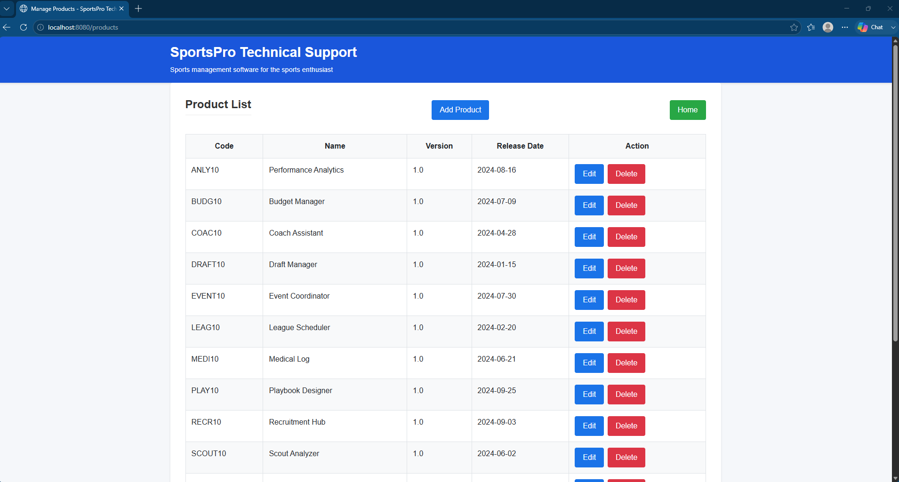

### 11.3 Technician Management

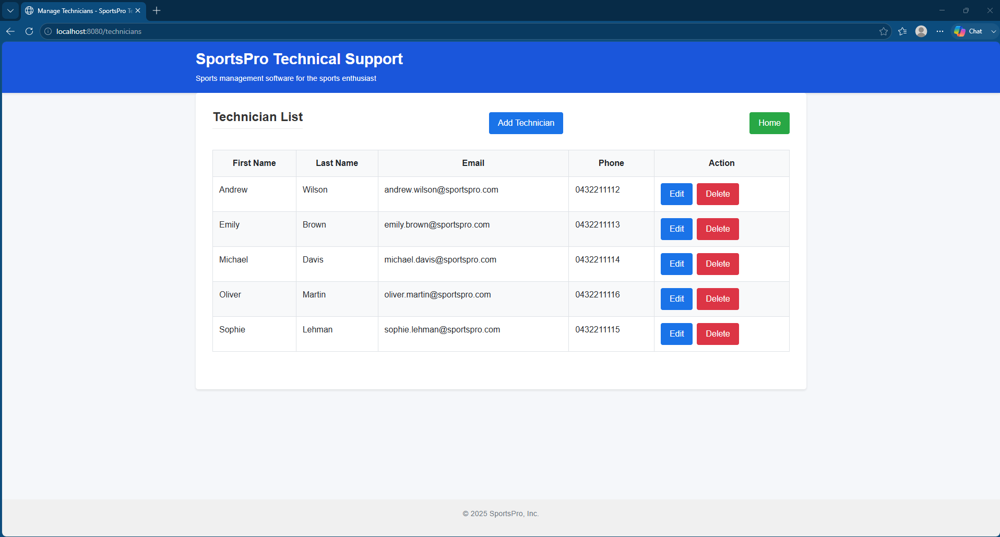

### 11.4 Customer Management

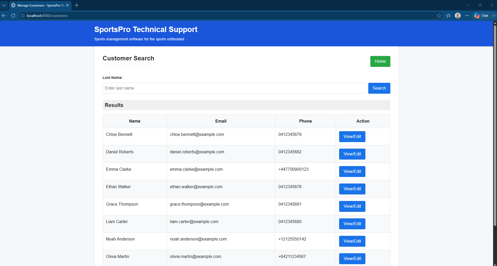

### 11.5 Customer Login

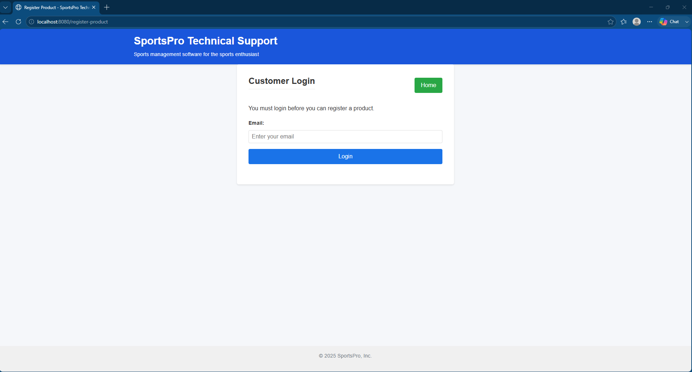

### 11.6 Product Registration

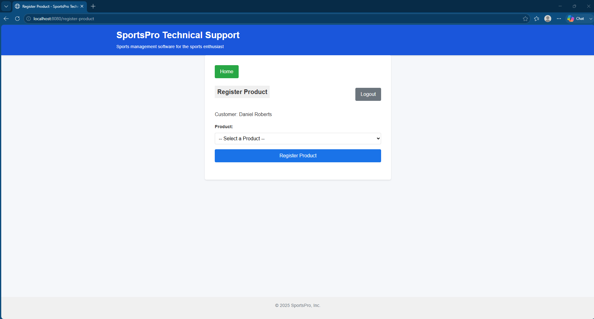

### 11.7 Docker Containers

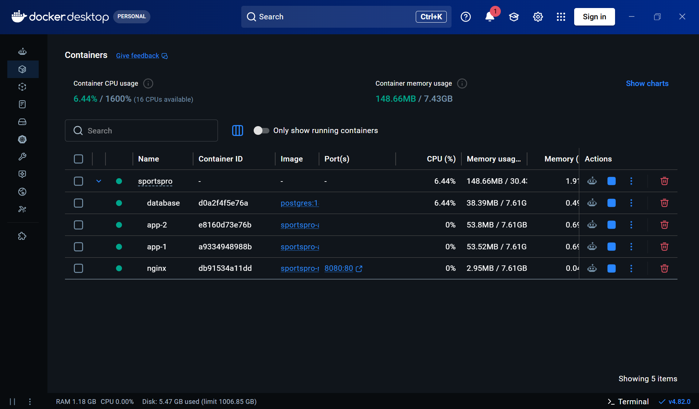

### 11.8 Docker Containers Status

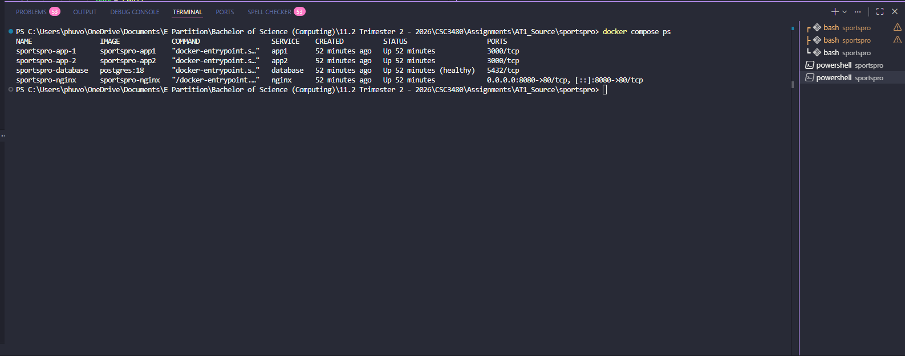

### 11.9 Database Seed

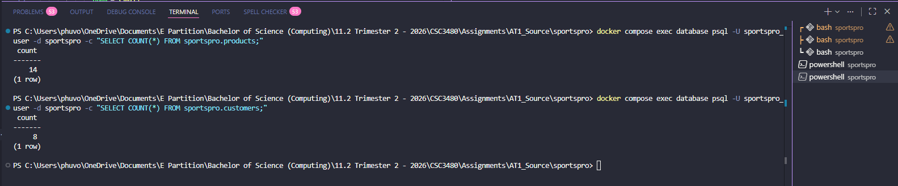

### 11.10 Nginx Reverse Proxy

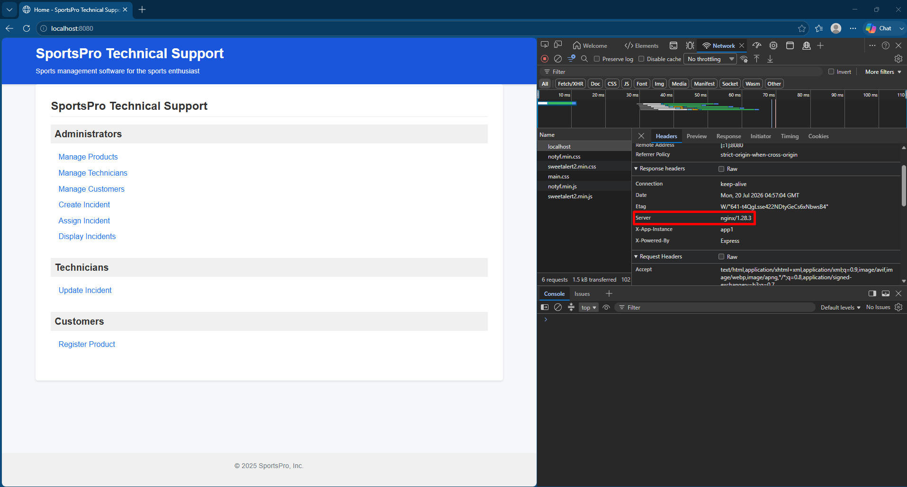

### 11.11 Load Balancing

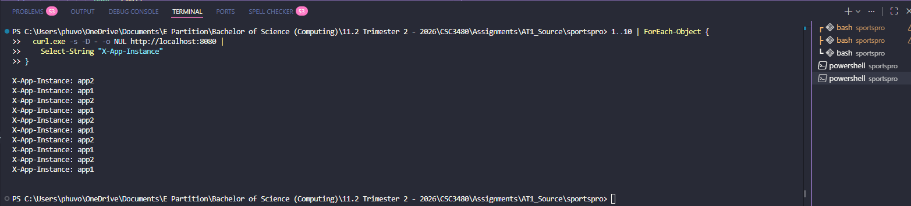

---

## ⚠️ 12. Assumptions

- Docker Desktop is installed and running.
- Port 8080 is available.
- Docker will automatically create the PostgreSQL database and import the supplied sample data.
- Internet access is required only during the first build to download Docker images.
- The application is intended for assignment/demo use rather than production deployment.

---

## 📝 13. Known Limitations

- No authentication system for administrators.
- Product registration currently uses customer email only for login.
- Load balancing uses the default round-robin strategy without sticky sessions.
- The UI does not persist authenticated customer state with a real server-side session or token system.

---

## 👨‍💻 14. Project Information

**Course:** CSC3480 Web Technology

**Student:** Phu Vo

**Institution:** University of Southern Queensland
